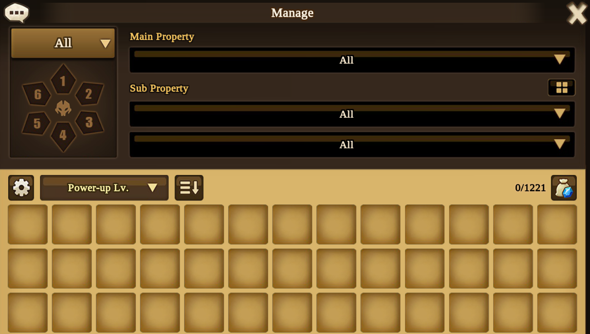

# SWRuneSorter
A tool that automatically scores, upgrades and sells runes for a certain Summoning game.


## Idea
No one wants to manually sort their runes. 
Most of the time, all we want to do is grind dungeons for a while and have the runes automatically upgraded and sold based on our preferences. 
This is what this project aims to do. 
You can define preferences in the form of weights that are used to determine the score of a rune. 
The score should range from 0 to 100 to have a reference point. 
Since there are so many ways to use runes, multiple such weights are needed. 
This allows you to have a weight profile for DPS, support, or even niche use case runes.
With a rune's score, you can set a threshold, and runes below that threshold can be sold.

## Approach
The general approach is to use OCR to recognize the rune, basic maths to score the rune, and mouse automation to navigate the menus. 
Exactly how (and how well) this works is still a work in progress that I will have to figure out as I go.

### Rune Scoring
The score of a natural rune should be between 0 and 100 to have a fixed reference point. 
Natural in this case means without amplified stats. 
A rune with a score of 100 (or close to it) should be the "perfect" natural rune according to the set weights. 
A rune above 100 is even better, but requires amplified stats. 
This means that the given weights have to be normalized against a "perfect" rune (which is a "perfectly" upgraded +15 rune), which should be determined automatically, based on the weights themselves (this will get more complicated later, because of the different slots). 
Runes consist of a main stat, an optional innate stat, and up to four substats. 
Since the innate stat is special and cannot be upgraded, it has separate weights. 
This is because there are some stats that we would rather have as sub or main stats than innate, and vice versa. 
Additionally, since runes with quad/triple rolls, i.e. runes that have four/three upgrades in a single substat, are easier to work with, we want to increase their score as well. 
There is no mathematical reason for this, just the ease of use of the runes. 
However, I would argue that the bonus should be almost insignificant.

Calculating the score of a rune is relatively simple. 
Given a rune and the stat and innate stat weights, we multiply each substat by its normalized weight, the main stat by its normalized weight, and the innate stat by its normalized innate stat weight. 
Finally, we sum the products to get the final score of the rune based on the given weight profile. 

This is where the simplicity ends. 
Since some substats are blocked from certain rune slots, and each slot has different primary stats, there is no "perfect" rune for all slots. 
Therefore, one "perfect" rune per slot must be determined, and the normalization must be done per slot. 
This ensures that a rune with a score of 100 is possible in every slot.
There are probably more problems that I do not know about yet, but I will add them to this document.

## Limitations
There are, of course, limitations to this project and its use. 
The runes that are considered by this project are limited to 6-star runes of hero or legend quality. 
5-star or lower runes will be compared to 6-star runes. 
Endgame players may not need this tool, as they have sufficient knowledge of runes. 
This project is made by a beginner who wants to automate the boring and repetitive task of upgrading and selling useless runes.

# Components
## ScreenMarker
### Overview
The ScreenMarker component is designed to assist in the marking of relevant locations on the screen for the main application. 
This can be a button to click on or a Region of Interest (ROI) to read information from. 

## RuneUpgrader
A cli tool that requires the `json-dump.json` from the `ScreenMarker` component to be in the current working directory.
The manage rune window should be open with no filter applied, sorted by `Power-up Lv.` descending and no slots selected:

Launch while the game is running with:
```bash
python rune_upgrader.py
```

The script will automatically move your mouse to select runes, take screenshots and use ocr to recognize runes and 
use the determined score to upgrade or sell the selected rune.
The script should not sell any of your already upgraded runes on its own.
After going through all 6 slots of runes, the script will stop.